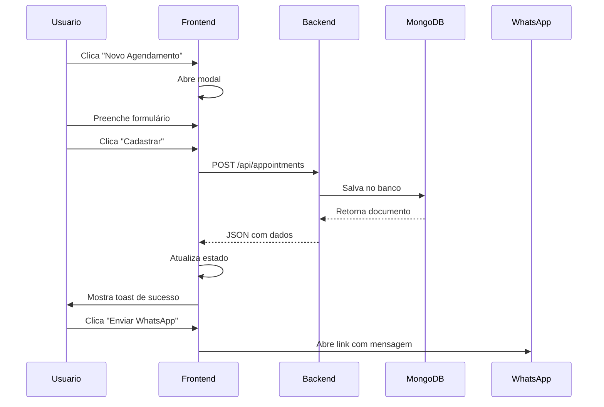

# 📦 Handoff para Desenvolvedor Backend - BarberPro

## 🎯 Resumo Executivo

O **frontend do BarberPro está 100% pronto** e aguardando apenas a API REST para funcionar completamente. Todos os componentes, estados e chamadas de API já estão implementados.

---

## ✅ O Que JÁ Está Pronto (Frontend)

### Páginas Completas
- ✅ Home page com hero section
- ✅ Login e cadastro
- ✅ Dashboard com agenda semanal interativa
- ✅ Histórico de agendamentos com filtros
- ✅ Formulário de novo agendamento
- ✅ Sistema de toast notifications
- ✅ Design responsivo (mobile + desktop)

### Funcionalidades Implementadas
- ✅ **Listar agendamentos** (GET /api/appointments)
- ✅ **Criar agendamento** (POST /api/appointments)
- ✅ **Toggle pagamento** (PATCH /api/appointments/:id/toggle-payment)
- ✅ **Cancelar agendamento** (PATCH /api/appointments/:id/cancel)
- ✅ **Buscar métricas** (GET /api/metrics)
- ✅ **Envio via WhatsApp** com chave PIX
- ✅ **Loading states** e tratamento de erros
- ✅ **LocalStorage** como fallback

---

## 📋 O Que Você Precisa Fazer (Backend)

### 1️⃣ Criar 6 Endpoints REST

| Método | Endpoint | Descrição |
|--------|----------|-----------|
| GET | `/api/appointments` | Listar agendamentos |
| GET | `/api/appointments?status=active` | Listar apenas ativos |
| GET | `/api/appointments?status=canceled` | Listar apenas cancelados |
| POST | `/api/appointments` | Criar novo agendamento |
| PATCH | `/api/appointments/:id/toggle-payment` | Alternar status de pagamento |
| PATCH | `/api/appointments/:id/cancel` | Cancelar agendamento |
| GET | `/api/metrics` | Buscar métricas do dashboard |

### 2️⃣ Modelo de Dados MongoDB

```javascript
{
  _id: ObjectId,
  client: String,        // Nome do cliente
  service: String,       // "Corte", "Corte + Barba", "Barba", "Corte Premium"
  time: String,          // "09:00", "10:00", etc
  day: String,           // "Segunda", "Terça", "Quarta", etc
  status: String,        // "confirmed" ou "canceled"
  paid: Boolean,         // true/false
  value: Number,         // Valor em reais (40, 60, 30, 80)
  phone: String,         // Telefone do cliente (opcional)
  createdAt: Date,       // Auto
  updatedAt: Date,       // Auto
  canceledAt: Date       // Quando foi cancelado (opcional)
}
```

### 3️⃣ Validações Importantes

- ✅ **Horário único**: Não permitir 2 agendamentos no mesmo dia/horário
- ✅ **Horários válidos**: 09:00, 10:00, 11:00, 12:00, 14:00, 15:00, 16:00, 17:00, 18:00
- ✅ **Dias válidos**: Segunda a Sábado
- ✅ **Serviços válidos**: "Corte", "Corte + Barba", "Barba", "Corte Premium"
- ✅ **Valor não negativo**: value >= 0

---

## 🚀 Quick Start

### Opção 1: Node.js + Express (Recomendado)

```bash
# 1. Instalar dependências
npm init -y
npm install express mongoose cors dotenv

# 2. Configurar MongoDB Atlas
# Criar cluster gratuito em mongodb.com/cloud/atlas

# 3. Criar arquivo .env
echo "MONGODB_URI=mongodb+srv://..." > .env
echo "PORT=3000" >> .env

# 4. Implementar endpoints (ver BACKEND_GUIDE.md)

# 5. Rodar servidor
node server.js
```

### Opção 2: Já Tem Backend?

Apenas adicione os 6 endpoints seguindo a documentação em [`BACKEND_GUIDE.md`](./BACKEND_GUIDE.md)

---

## 📚 Documentação Disponível

| Arquivo | Conteúdo |
|---------|----------|
| [`BACKEND_GUIDE.md`](./BACKEND_GUIDE.md) | 📖 Guia completo com exemplos de código |
| [`services/api.ts`](./services/api.ts) | 🔌 Service do frontend (referência) |
| [`.env.example`](./.env.example) | ⚙️ Variáveis de ambiente |

---

## 🔗 Integração Frontend ↔ Backend

### 1. Frontend chama API via `services/api.ts`

```typescript
// Exemplo: Criar agendamento
const appointment = await createAppointment({
  client: "João Silva",
  service: "Corte + Barba",
  time: "09:00",
  day: "Segunda",
  status: "confirmed",
  paid: false,
  value: 60,
  phone: "+5511987654321"
});
```

### 2. Backend responde com JSON

```json
{
  "_id": "507f1f77bcf86cd799439011",
  "client": "João Silva",
  "service": "Corte + Barba",
  "time": "09:00",
  "day": "Segunda",
  "status": "confirmed",
  "paid": false,
  "value": 60,
  "phone": "+5511987654321",
  "createdAt": "2025-01-10T10:00:00.000Z",
  "updatedAt": "2025-01-10T10:00:00.000Z"
}
```

### 3. Frontend atualiza automaticamente

O estado do React é atualizado e a UI reflete as mudanças **instantaneamente**.

---

## ⚡ Fluxo Completo de um Agendamento



---

## 🔧 Configuração do CORS

**IMPORTANTE**: Configure CORS no backend para aceitar o frontend

```javascript
const cors = require('cors');

app.use(cors({
  origin: 'http://localhost:5173', // URL do frontend
  methods: ['GET', 'POST', 'PUT', 'PATCH', 'DELETE'],
  credentials: true
}));
```

---

## 📊 Endpoint de Métricas - Lógica Detalhada

```javascript
// GET /api/metrics
{
  totalCuts: 38,              // Quantidade de agendamentos confirmados
  totalRevenue: 1920,         // Soma dos valores onde paid = true
  uniqueClients: 38,          // Quantidade de clientes únicos (distinct)
  occupancyRate: 70,          // (totalCuts / 54 slots) * 100
  busiestHour: "10:00",       // Horário com mais agendamentos
  growthPercentage: 12        // Comparação com mês anterior (ou fixo)
}
```

### Cálculo da Taxa de Ocupação

```
Total de slots = 9 horários × 6 dias = 54 slots/semana
Taxa = (agendamentos_confirmados / 54) * 100
```

---

## 🐛 Tratamento de Erros Esperado

### Erro 400: Horário Ocupado
```json
{
  "error": "Horário já ocupado",
  "message": "Já existe um agendamento para Segunda às 09:00"
}
```

### Erro 404: Agendamento Não Encontrado
```json
{
  "error": "Agendamento não encontrado"
}
```

### Erro 500: Erro Interno
```json
{
  "error": "Erro interno do servidor",
  "message": "Detalhes do erro..."
}
```

---

## ✅ Checklist de Entrega

### Backend
- [ ] MongoDB configurado (Atlas ou local)
- [ ] 6 endpoints implementados e testados
- [ ] CORS configurado corretamente
- [ ] Validações de dados implementadas
- [ ] Tratamento de erros adequado
- [ ] Deploy realizado (Heroku/Railway/Render)
- [ ] URL da API fornecida para configurar frontend

### Frontend
- [ ] Atualizar `VITE_API_URL` no `.env`
- [ ] Atualizar `PIX_KEY` em `DashboardPage.tsx`
- [ ] Atualizar `WHATSAPP_NUMBER` em `DashboardPage.tsx`
- [ ] Testar todas as funcionalidades
- [ ] Build de produção (`npm run build`)

---

## 🎯 Prioridades de Implementação

### Fase 1 (MVP - 2-3 horas)
1. ✅ Configurar MongoDB
2. ✅ Criar modelo Appointment
3. ✅ Implementar GET /appointments
4. ✅ Implementar POST /appointments
5. ✅ Testar localmente

### Fase 2 (Core - 2 horas)
6. ✅ Implementar PATCH /toggle-payment
7. ✅ Implementar PATCH /cancel
8. ✅ Implementar GET /metrics
9. ✅ Adicionar validações

### Fase 3 (Polish - 1 hora)
10. ✅ Tratamento de erros robusto
11. ✅ Deploy
12. ✅ Testes finais

**Estimativa Total: 5-6 horas**

---

## 📞 Pontos de Contato

### Dúvidas Técnicas
- 📖 Ver [`BACKEND_GUIDE.md`](./BACKEND_GUIDE.md) completo
- 🔍 Inspecionar [`services/api.ts`](./services/api.ts)
- 💬 Abrir issue no repositório

### Configuração Frontend
- ⚙️ Arquivo: [`.env.example`](./.env.example)
- 🔑 Chave PIX: Configurar em `DashboardPage.tsx` linha 18
- 📱 WhatsApp: Configurar em `DashboardPage.tsx` linha 17

---

## 🎉 Resultado Final

Após implementação da API:

✅ Sistema **100% funcional**  
✅ Agendamentos salvos no MongoDB  
✅ Métricas em tempo real  
✅ Cancelamento com histórico  
✅ Toggle de pagamento persistente  
✅ WhatsApp automático com PIX  
✅ UI responsiva e moderna  

---

## 📦 Entrega

Forneça ao frontend:

1. **URL da API**: `https://api.barberpro.com` (exemplo)
2. **Confirmação** de endpoints funcionando
3. **Acesso ao MongoDB** (se necessário)

Frontend atualiza `.env`:
```env
VITE_API_URL=https://api.barberpro.com/api
```

**Pronto! Sistema completo em produção!** 🚀

---

**Desenvolvido com ❤️ para barbeiros modernos** ✂️
